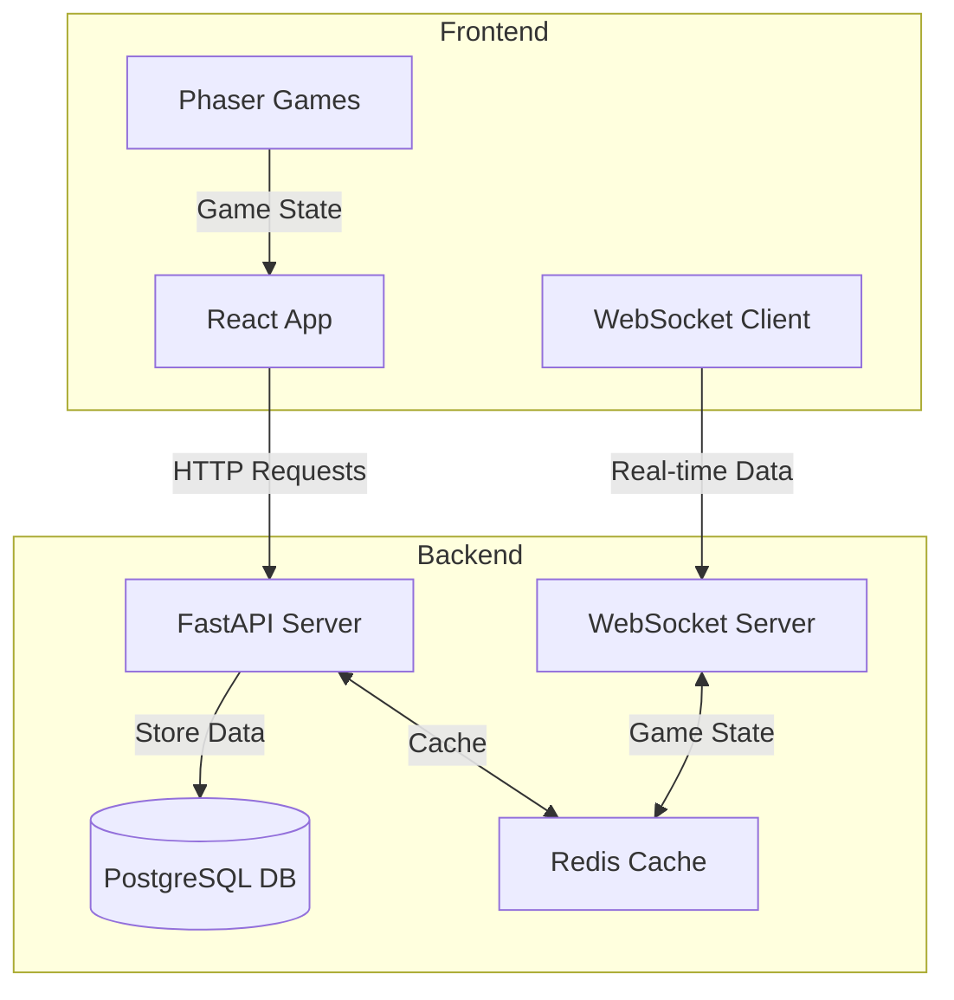

# AysieElf Games Architecture

## System Overview
This document describes the high-level architecture of AysieElf Games platform.

## Architecture Diagram


## Components Description

### Frontend
- **React App**: Main application interface
- **Phaser Games**: Game engine integration
- **WebSocket Client**: Real-time communication for multiplayer

### Backend
- **FastAPI Server**: REST API endpoints
- **WebSocket Server**: Real-time game state management
- **Redis Cache**: Temporary state and session storage
- **PostgreSQL DB**: Persistent data storage
```
