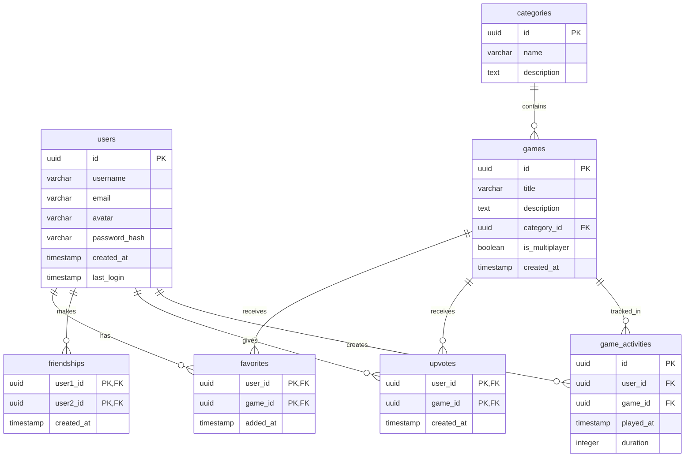

# Database Documentation

## Schema Diagram

## Tables Description

### users
Main user table storing account information
- `id`: Unique identifier (UUID)
- `username`: Unique username (max 50 chars)
- `email`: Unique email address (max 100 chars)
- `avatar`: Optional profile picture URL
- `password_hash`: Hashed password
- `created_at`: Account creation timestamp
- `last_login`: Last login timestamp

### categories
Game categories (e.g., Puzzle, Action, etc.)
- `id`: Unique identifier (UUID)
- `name`: Category name (max 50 chars)
- `description`: Optional category description

### games
Available games in the platform
- `id`: Unique identifier (UUID)
- `title`: Game title (max 100 chars)
- `description`: Game description
- `category_id`: Reference to categories table
- `is_multiplayer`: Whether game supports multiplayer
- `created_at`: Game addition timestamp

### favorites
User-game favorites mapping
- `user_id`: Reference to users table
- `game_id`: Reference to games table
- `added_at`: When the game was favorited

### friendships
Bi-directional user friendships
- `user1_id`: Reference to users table (smaller UUID)
- `user2_id`: Reference to users table (larger UUID)
- `created_at`: Friendship creation timestamp

### upvotes
User game ratings
- `user_id`: Reference to users table
- `game_id`: Reference to games table
- `created_at`: Upvote timestamp

### game_activities
Game play tracking
- `id`: Unique identifier (UUID)
- `user_id`: Reference to users table
- `game_id`: Reference to games table
- `played_at`: Activity timestamp
- `duration`: Play duration in seconds

## Indexes
- **Users**: Username and email for quick lookups
- **Games**: Title and category for filtering
- **Activities**: User-game combination for history
- **Composite**: For optimizing common queries like:
  - User's favorites by date
  - Game upvotes count
